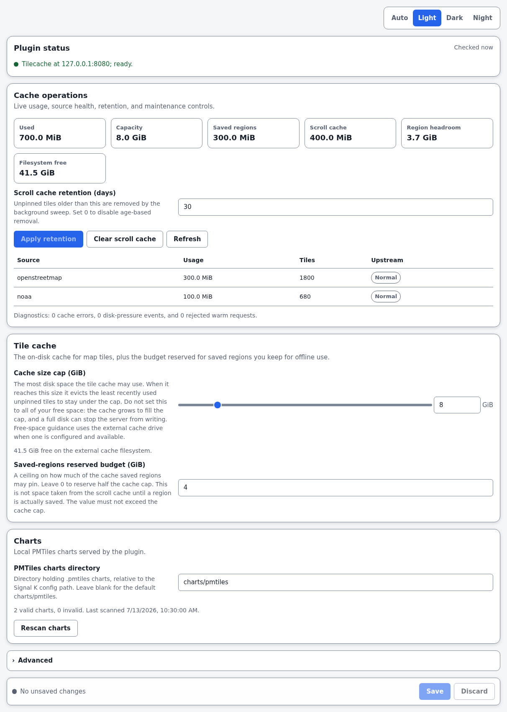
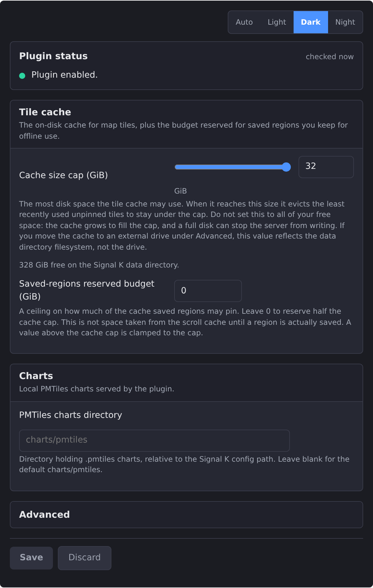
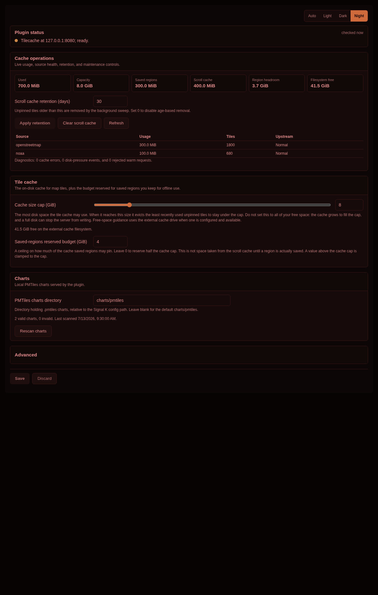

# Chart Locker

[](https://www.npmjs.com/package/signalk-chart-locker)
[](https://www.npmjs.com/package/signalk-chart-locker)
[](https://github.com/NearlCrews/signalk-chart-locker/actions/workflows/ci.yml)
[](https://github.com/NearlCrews/signalk-chart-locker/blob/main/LICENSE)
[](https://nodejs.org)
[](https://www.buymeacoffee.com/nearlcrews)

A Signal K plugin that runs a Rust container alongside the server to host a shared tile cache
and local PMTiles chart serving.

> The cached tiles and local chart files are advisory. They are not certified for
> safety-of-life navigation: always cross-check against official charts and your primary
> instruments.

## What's new in 0.5.0

Version 0.5.0 adopts `signalk-chart-sources` 0.3.1, including disjoint source coverage and
source-specific download estimates. Saved regions and PMTiles charts now work across the
antimeridian, region replacements are staged and promoted atomically, and overlapping source
coverage is deduplicated before download.

PMTiles discovery and serving now remain available without the container runtime, directory watches
recover from failures, and chart responses are protected against path swaps. Runtime validation,
retry behavior, cache database recovery, and warm-job status reporting are also stricter. This
release requires Node.js 22 or newer.

See the [0.5.0 changelog](CHANGELOG.md#v050) for the full list.

## What it does

Chart Locker is a Signal K server plugin. It manages a container (via the
[signalk-container](https://github.com/dirkwa/signalk-container) plugin) that runs a Rust service
alongside the server. That service handles the shared tile cache that every device on the boat reads
from. The Node.js plugin discovers and serves local `.pmtiles` charts with proper HTTP caching
semantics, independently of the container runtime.

The plugin side is thin by design. It resolves the `signalk-container` manager, starts the
tilecache container, and exposes the regions and chart-management HTTP routes. All tile-cache
compute lives in the container.

The tilecache container also reports its update state in the `signalk-container` Container Manager
panel: an "up to date" badge, a "checked N ago" timestamp, and a "Check now" button. The check
reads the GitHub releases of this repository, and because the container image tag is pinned to the
plugin version, "update available" means a newer Chart Locker release exists: update the plugin in
the App Store and the container is recreated on the new tag. Offline at sea the check reports the
last cached result and never fabricates an update. The badge needs `signalk-container` 1.20.2 or
newer; older versions skip the registration and everything else works unchanged.

When Chart Locker is absent, the Binnacle chartplotter falls back to direct upstream sources for
tiles. A standalone install of Binnacle is unaffected.

## Features

- **Shared boat-wide tile cache.** Every raster overlay, the vector basemap, and its glyphs are
  fetched and cached through the Signal K server. Every device on the boat reads from the same
  cache, the same tile is never fetched more than once, and the overlays keep rendering offline
  at sea.
- **Saved regions.** Draw a box in the Binnacle chartplotter and download the raster overlays
  covering it into the shared cache before leaving internet coverage. Each region is named
  automatically by a reverse geocode, saved durably, and can be re-downloaded or deleted. A live
  byte estimate is re-validated on the server against the saved-regions budget before the download
  starts, so an over-budget region is refused. The region tiles are pinned and never evicted, and a
  region never stays stuck downloading.
- **Auto-cache around the boat.** An optional throttled fill keeps a small tile radius warm around
  the vessel as it travels outside the saved regions, always LRU-bounded so it never displaces
  the pinned coverage. A radius that crosses the antimeridian is split into two bounded boxes and
  completed as one warm job.
- **Local PMTiles chart provider.** Drop `.pmtiles` archives in the charts folder and the
  companion discovers, validates, and registers them without a plugin restart. Each archive is
  served with a strong ETag and HTTP Range support so the browser cache works. A chart-management
  panel in the Binnacle chartplotter lists the detected archives. Defers gracefully to
  `signalk-pmtiles-plugin` when that plugin is enabled.
- **Operational configuration panel.** Inspect cache usage, filesystem headroom, source health,
  diagnostics, and chart discovery without leaving the Signal K admin UI. Change scroll retention,
  clear only unpinned scroll tiles, refresh live state, and request a chart rescan from the same panel.

## Requirements

- Signal K server 2.x.
- Node.js >= 22.
- [signalk-container](https://www.npmjs.com/package/signalk-container) >= 1.20.2 and a container
  runtime (Podman or Docker) accessible to Signal K are required for tile caching, saved-region
  downloads, position warming, and reverse geocoding. Local PMTiles discovery and serving continue
  without them. Versions of `signalk-container` before 1.20.2 still run the tile cache, just without
  the Container Manager update badge.
- The [Binnacle Chartplotter](https://www.npmjs.com/package/signalk-binnacle) for the regions
  and chart-management panels.

On secured Signal K servers, chart tiles, styles, readiness checks, and PMTiles files are available
to authenticated `readonly`, `readwrite`, and administrator users. Saving regions, changing cache
settings, reverse geocoding, and editing chart metadata require an administrator session. Signal K
servers with security disabled continue to expose the read routes without a login.

## Installation

**From the App Store (recommended).** In the Signal K admin UI, open Apps and Plugins, then
Store, search for Chart Locker, and install. Restart the server when prompted.

**With npm.** Install into the server's home directory and restart Signal K:

```bash
cd ~/.signalk
npm install signalk-chart-locker
```

## Configuration

After installation, enable the plugin in the Signal K plugin configuration panel. Chart Locker
starts the tilecache container automatically when Signal K restarts. No further configuration is
required for the tile cache or the PMTiles provider.

**Tile cache capacity.** The cache cap slider moves in 4 GiB steps from 4 through 32 GiB. On a new
configuration, the panel recommends about 80 percent of the free space on the filesystem that will
hold the cache, floored to the nearest 4 GiB and capped at 32 GiB. When an external cache path is
configured and available, its filesystem is measured. If it is unavailable, the panel clearly
reports that free-space guidance has fallen back to the Signal K data filesystem.

The saved-regions budget is a ceiling on pinned region tiles. Leave it at 0 to use half the cache
cap. It must not exceed the cache cap. This budget does not remove space from the scroll cache until
a region is saved. A region download pins its tiles and evicts only unpinned scroll tiles to make
room. Pinned tiles are never evicted by scroll-cache pressure.

The settings panel also provides live cache operations: total, pinned, and scroll usage; remaining
saved-region headroom; actual filesystem free space; per-source usage and upstream health; scroll
retention; and a safe clear action that preserves saved-region tiles. The cache keeps 256 MiB of
filesystem headroom outside its configured cap. Under disk pressure it continues serving fetched
tiles without writing them and reports the degraded state in the panel.

**Scroll retention.** Set retention from 0 through 365 days. A value of 0 disables age-based
removal. The clear action removes every unpinned scroll tile and preserves saved-region and other
pinned tiles. Retention changes are persisted even when the container is temporarily unavailable and
are pushed again on the next start.

**External cache drive.** The Advanced section accepts an absolute host path for a USB SSD, NVMe
drive, or other cache filesystem. A relative path is rejected. If the path is missing at startup,
`signalk-container` applies its configured fallback behavior and the panel reports the measurement
fallback rather than presenting the data filesystem as the external drive.

**PMTiles charts.** Place `.pmtiles` files in the server's charts folder (the same folder
`signalk-pmtiles-plugin` uses). The companion detects and registers them automatically. If
`signalk-pmtiles-plugin` is already enabled and serving that folder, the companion surfaces a
clear status and defers to it.

The panel reports valid and invalid archives, their latest scan time, and each validation error. Use
the Rescan charts action after copying files when an operating-system watch event was delayed.

The charts path must be relative to the Signal K configuration directory and cannot escape it with
`..`. The optional image tag in Advanced must be a valid OCI tag. Invalid settings are shown next to
the configuration and rejected again by the plugin before any container work starts.

Saving cache limits, chart discovery settings, or container settings can reapply configuration or
recreate the tile-cache container. The panel summarizes that restart impact before saving.

## Reliability and recovery

- State files are written through a flushed temporary file and atomically renamed, preventing a
  partial JSON document after power loss.
- A database-aware health check verifies SQLite before the container reports healthy. The plugin
  separately reports whether the source and budget configuration push has completed.
- If the disposable cache database is recreated, saved regions whose pinned bytes disappeared are
  marked `needs-redownload` instead of remaining falsely ready.
- A failed region re-download keeps the prior region state. A missing warm job is reconciled to an
  error instead of leaving the region stuck downloading.
- Position-warm, saved-region, chart override, and direct plugin configuration inputs are validated
  at their server boundaries.

See [Operations](docs/OPERATIONS.md) for status interpretation, diagnostics, recovery procedures,
and structured log events. See [HTTP API](docs/API.md) for the plugin routes and validation limits.

## Configuration panel

| Light | Dark | Night red |
| ----- | ---- | --------- |
|  |  |  |

## Development

This project targets Node.js 22 or newer. The Rust container is a Cargo workspace under
`container/`.

```bash
git clone https://github.com/NearlCrews/signalk-chart-locker.git
cd signalk-chart-locker
npm install
npm run typecheck   # TypeScript type-check
npm run lint        # ESLint
npm test            # node --test unit tests
npm run build       # clean and compile dist/, then build the panel remote
npm run check:package
npm audit --omit=dev
```

Rust (Cargo workspace):

```bash
cd container
cargo test --workspace
cargo clippy --workspace --all-targets --all-features -- -D warnings
cargo build --release --bin tilecache
cargo install cargo-audit --locked
cargo audit --file Cargo.lock
```

Before a release, also verify the panel in a real browser and follow the
[publish runbook](docs/superpowers/2026-06-30-publish-runbook.md). Publishing the npm package or
creating the version tag requires explicit owner approval.

## License

MIT. See [LICENSE](LICENSE) for the full text. The software is provided "AS IS", without warranty
of any kind.

## Acknowledgments

Chart Locker is written and maintained by [Nearl Crews](https://github.com/NearlCrews). It
relies on:

- [Signal K Project](https://signalk.org/) for the open marine data standard.
- [signalk-container](https://github.com/dirkwa/signalk-container) for container lifecycle
  management.

Chart Locker pairs with the
[Binnacle Chartplotter](https://www.npmjs.com/package/signalk-binnacle).

## Support

Find this project useful? You can support its continued development by
[buying me a coffee](https://www.buymeacoffee.com/nearlcrews).

- [Report a bug](https://github.com/NearlCrews/signalk-chart-locker/issues/new?template=bug_report.yml)
- [Request a feature](https://github.com/NearlCrews/signalk-chart-locker/issues/new?template=feature_request.yml)
- [Security issues](.github/SECURITY.md)
